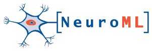

# COMBINE standards in modelspec

To illustrate the utility of modelspec, and to create a uniform, compatible set of APIs across a diverse range of model specification formats, we are investigating the [COMBINE set of standards in computational biology](https://co.mbine.org/standards/), and attempting to express these formats in modelspec.

## NeuroML

A preliminary version of an API for [NeuroML2](https://docs.neuroml.org/Userdocs/NeuroMLv2.html) can be found [here](neuroml2). This allows generation of NeuroML2 models using the modelspec based API, saving as valid XML, as well as JSON, YAML and BSON equivalents. See [neuroml2_spec.py](neuroml2/neuroml2_spec.py).

[NeuroMLlite](https://github.com/NeuroML/NeuroMLlite) already uses modelspec as its primary specification format. See [here](https://github.com/NeuroML/NeuroMLlite/blob/master/neuromllite/__init__.py).

## SBML

Work towards an API for [SBML](https://www.sbml.org/) can be found [here](sbml).

An example of an SBML file generated from this is [here](sbml/test_minimal_example.xml).

## CellML

TODO...

## SED-ML

TODO...
